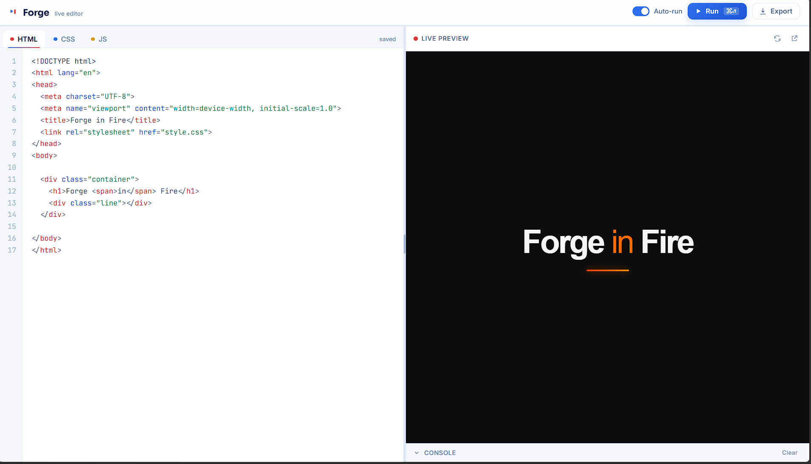
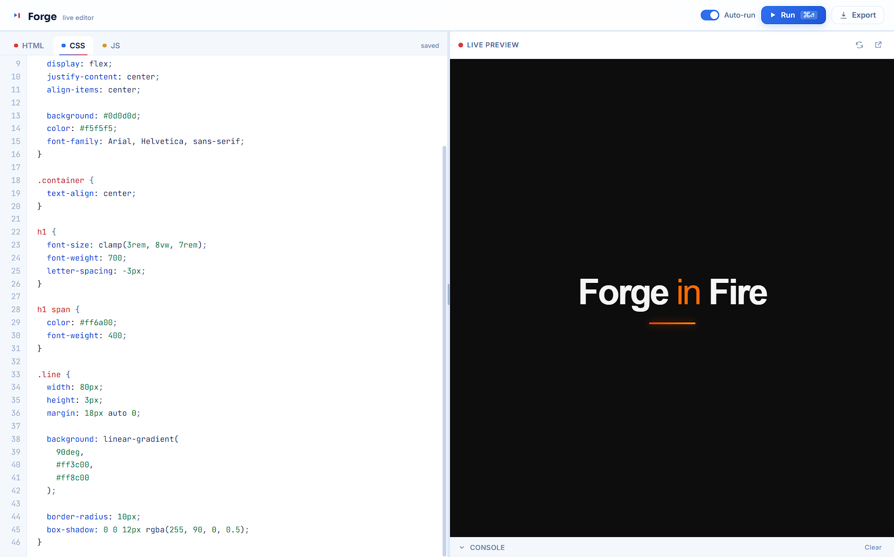

# Forge

A self-contained, in-browser code playground. Write HTML, CSS, and JavaScript in three tabbed editors and watch the result render instantly in a live preview pane, complete with a console that captures `console.log`, warnings, and runtime errors from your code.

Built with **vanilla HTML, CSS, and JavaScript** — no frameworks, no build step, no dependencies.

## 🌐 Live Demo

🔗 **Try the application here:**

**https://forge-six-delta-51.vercel.app/**

> Experience the app directly in your browser—no installation required.

## 📸 Preview





## Features

- **Three-language editing** — separate HTML, CSS, and JS tabs, each with line numbers and lightweight syntax highlighting (tags, attributes, selectors, properties, strings, comments, keywords, numbers).
- **Live preview** — renders in a sandboxed `<iframe>`. Auto-runs 450ms after you stop typing, or run manually with the **Run** button / `⌘`/`Ctrl` + `Enter`.
- **Console panel** — `console.log/info/warn/error` calls and uncaught errors inside your code stream into a collapsible console panel in the app itself, not just the browser devtools.
- **Autosave** — your code is saved to `localStorage` as you type and restored on your next visit.
- **Resizable workspace** — drag the divider between the editor and preview, or use the arrow keys while it's focused.
- **Export** — download a single merged HTML file, or separate `index.html` / `style.css` / `script.js` files.
- **Pop out** — open the current output in its own browser tab.
- **Responsive** — collapses to a single-pane, tab-switchable layout (Code / Preview) on narrow screens.
- **Accessible basics** — visible focus states, `aria` attributes on tabs and toggles, `prefers-reduced-motion` respected.

## Getting started

No installation or build step is required.

1. Download `index.html`, `styles.css`, and `script.js` and keep them in the same folder.
2. Open `index.html` directly in any modern browser (double-click it, or right-click → *Open with* your browser).

That's it — the editor opens with three blank panels, ready for your own HTML, CSS, and JS.

> The app links to Google Fonts (Sora, Inter, JetBrains Mono) for its typography. If you're offline, it falls back gracefully to system fonts — everything still works.

## How to use it

| Action | How |
|---|---|
| Switch between HTML / CSS / JS | Click a tab, or click into any editor |
| Run manually | **Run** button, or `⌘Enter` / `Ctrl+Enter` |
| Toggle auto-run | The switch in the top bar |
| Export your project | **Export** menu → single file or separate files |
| Open output in a new tab | The pop-out icon above the preview |
| See logs/errors | Click **Console** at the bottom of the preview pane |
| Resize panels | Drag the vertical divider between editor and preview |

On phones and narrow windows, a **Code / Preview** switcher replaces the side-by-side layout.

## How it works

- **Editors**: each panel is a transparent `<textarea>` layered exactly over a `<pre>` element that renders syntax-highlighted markup underneath it. The textarea remains the real, editable source of truth (so copy/paste, undo, and selection all behave normally); the `<pre>` layer is purely visual and kept in sync on every keystroke and scroll event. A synced gutter renders line numbers.
- **Highlighting**: small, dependency-free regex-based tokenizers for each language (`highlightHTML`, `highlightCSS`, `highlightJS`) wrap recognized tokens in `<span>` elements with themed colors.
- **Live preview**: your HTML, CSS, and JS are assembled into one HTML document and injected into a sandboxed `<iframe>` via `srcdoc`. A small bridge script is inserted into that document which overrides `console.log/info/warn/error` and listens for uncaught errors, forwarding everything to the parent page with `postMessage` so it can be displayed in the console panel.
- **Persistence**: code and your auto-run preference are saved to `localStorage` on every change and restored on load. Nothing is sent to a server — everything stays in your browser.
- **Export**: uses `Blob` + a temporary `<a download>` link to generate downloadable files client-side.

## Design notes

The visual language is a clean, professional light-blue theme: white and near-white surfaces, a single confident blue for primary actions and focus states, and red held in reserve for just two meanings — the live-preview indicator and error/unsaved states — so it always reads as a signal, never decoration. Set in Sora (display), Inter (UI text), and JetBrains Mono (code). The signature detail is the **signal bar**: a thin channel beneath the top bar that sweeps a blue-to-red pulse across the screen every time you run your code, visualizing the idea of code becoming a rendered signal.

## Browser support

Any modern evergreen browser (Chrome, Edge, Firefox, Safari). Uses standard APIs only: `localStorage`, `Blob`, `postMessage`, iframe `srcdoc`, and CSS custom properties.

## File structure

```
├── index.html     — markup and structure
├── styles.css     — design tokens, layout, theming, responsive rules
├── script.js      — editor logic, highlighting, preview, console, export
└── README.md      — this file
```
